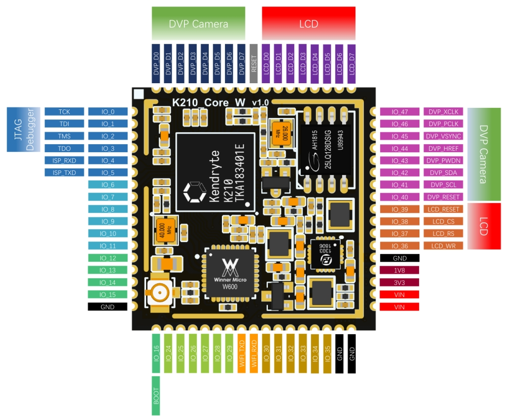

<br />
<br />

<a href="LICENSE.md">
    
</a>


<br/>
<br/>

* [中文](README_ZH.md)
* [English](README.md)

<br />
<br />

**CanMV, 让 AIOT 更简单～**

此实现基于Sipeed MaixPy，但它与之不同，现在是一个完全独立的项目。感谢Sipeed对MaixPy的贡献！

CanMV 的目的是让 AIOT 编程更简单， 基于 [Micropython](http://www.micropython.org) 语法, 运行在[Canan](https://kendryte.com)强大的嵌入式AI SOC系列上。目前它在K210上运行。


> K210 简介 : 
> * 拥有硬件加速的 AI 图像识别
> * 带硬件浮点运算的双核处理器
> * 8MB(6MB+2MB) 内存
> * 16MB 外置 Flash
> * 芯片 CPU 最高可达 800MHz 主频 (开发板支持最高主频具体看开发板介绍, 通常400MHz)
> * 麦克风阵列支持（8个麦克风）
> * 硬件 AES SHA256 支持
> * FPIOA (每个外设可以映射到任意引脚)
> * 外设: I2C, SPI, I2S, WDT, TIMER, RTC, UART, GPIO 等等

<div class="board_pic">
    
</div>

## CanMV 相关资源指南
| No  | Link address                                                                           | Description                                                 |
|:---:|----------------------------------------------------------------------------------------|-------------------------------------------------------------|
|  1  | /                                                                                      | CanMV SDK 根目录。                                              |
|  2  | /projects/xxx                                                                          | CanMV 开发板配置目录，您可以从这里开始定制编译您自己的固件，详细操作请参考 [CanMV build](build.md) |
|  3  | [ 使用 Docker 编译](tools/docker)                                                      | 提供 Docker 镜像用于固件编译，可以降低搭建编译环境的工作量。                          |
|  4  | [CanMV Docs](https://developer.canaan-creative.com/index.html?channel=developer#/document/canmv) | CanMV 文档，包括 API 说明、工具使用、常见问题以及其它。                           | 
|  5  | [CanMV IDE](https://github.com/kendryte/canmv_ide)                                     | CanMV IDE 用于编辑和调试，它支持 Windows, Linux and Mac OS等不同操作系统。     |
|  6  | [CanMV Examples](https://github.com/kendryte/canmv_examples)                           | 提供不同模块的使用示例，供学习参考。                                          |
|  7  | [CanMV Releases](https://github.com/kendryte/canmv/releases)                           | 提供 CanMV 固件下载。                                              |

## 简单易懂的代码

寻找 I2C 设备:

```python
from machine import I2C

i2c = I2C(I2C.I2C0, freq=100000, scl=28, sda=29)
devices = i2c.scan()
print(devices)
```

拍照:

```python
import sensor
import image
import lcd

lcd.init()
sensor.reset()
sensor.set_pixformat(sensor.RGB565)
sensor.set_framesize(sensor.QVGA)
sensor.run(1)
while True:
    img=sensor.snapshot()
    lcd.display(img)
```

使用 AI 模型进行人脸检测:
```python
import sensor, image, time, lcd
from maix import KPU
import gc

lcd.init()                          # 初始化LCD显示屏
sensor.reset()                      # 复位并初始化摄像头
sensor.set_pixformat(sensor.RGB565) # 设置摄像头输出格式为 RGB565
sensor.set_framesize(sensor.QVGA)   # 设置摄像头输出大小为 QVGA (320x240)
sensor.skip_frames(time = 1000)     # 等待摄像头稳定
clock = time.clock()                # 创建一个clock对象，用来计算帧率

anchor = (0.1075, 0.126875, 0.126875, 0.175, 0.1465625, 0.2246875, 0.1953125, 0.25375, 0.2440625, 0.351875, 0.341875, 0.4721875, 0.5078125, 0.6696875, 0.8984375, 1.099687, 2.129062, 2.425937)
kpu = KPU() # 创建一个kpu对象，用于人脸检测
kpu.load_kmodel("/sd/face_detect_320x240.kmodel") # 加载模型
# yolo2初始化
kpu.init_yolo2(anchor, anchor_num=9, img_w=320, img_h=240, net_w=320 , net_h=240 ,layer_w=10 ,layer_h=8, threshold=0.5, nms_value=0.2, classes=1)

while True:
    clock.tick()                # 更新计算帧率的clock
    img = sensor.snapshot()
    kpu.run_with_output(img)
    dect = kpu.regionlayer_yolo2()
    fps = clock.fps()
    if len(dect) > 0:
        for l in dect :
            a = img.draw_rectangle(l[0],l[1],l[2],l[3], color=(0, 255, 0)) # 画人脸框

    a = img.draw_string(0, 0, "%2.1ffps" %(fps), color=(0, 60, 128), scale=2.0)
    lcd.display(img)
    gc.collect()

kpu.deinit()
```
具体的使用方法请阅读教程后尝试

## 使用 `C` 语言开发项目

由于 C 语言比 python 具有更高的性能，您可能希望通过 C 来开发产品，而不是使用 python。在这种情况下，您仍然可以使用此代码库，可以通过禁用 micropython 组件来构建自己的 C 开发固件。有关用法的详细信息，请参阅[构建文档](build.md)，可以从编译下载 `projects/hello_world` 开始。

大致编译下载过程如下：

```
wget https://github.com/kendryte/kendryte-gnu-toolchain/releases/download/v8.2.0-20190409/kendryte-toolchain-ubuntu-amd64-8.2.0-20190409.tar.xz
sudo tar -Jxvf kendryte-toolchain-ubuntu-amd64-8.2.0-20190409.tar.xz -C /opt
cd projects/hello_world
python3 project.py menuconfig
python3 project.py build
python3 project.py flash -B dan -b 1500000 -p /dev/ttyUSB0 -t
```

## 版权声明

参见 [LICENSE](LICENSE.md) 文件。

## 贡献指南

如果您对本项目感兴趣，想要反馈问题或提交代码，请参考 [CONTRIBUTING](CONTRIBUTING.md)。

## 联系我们

北京嘉楠捷思信息技术有限公司  
网址：[canaan-creative.com](https://canaan-creative.com/)  
商务垂询：[salesAI@canaan-creative.com](mailto:salesAI@canaan-creative.com)