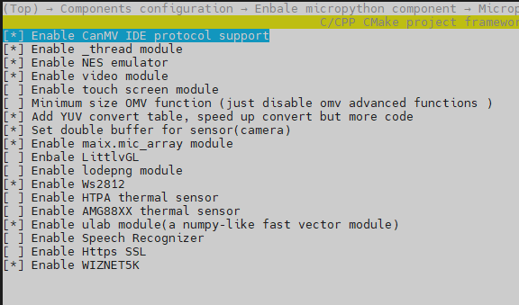
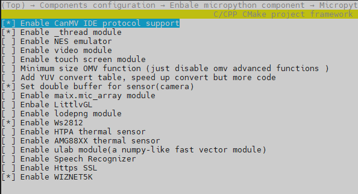

# Configure project | 项目配置

通过编译文档部分，我们已经知道可以自己通过`python3 project.py menuconfig`来自己配置项目要参与编译的代码模块，嵌入式开发由于芯片硬件资源的局限性，经常需要自己根据项目情况裁剪无用的代码以便释放更多的资源供应用开发使用。对于micropython来说，裁剪模组则是经常会用到的操作。

## 项目说明

- canmv_dock: Spieed Dock 板
- canmv_k1: Canaan K1 板
- canmv_k210: 01Studio CanMV K210 板
- hello_world: c开发示例工程

## 默认的配置文件
在每个项目中都会看到两个预设好的配置文件`config_standard.mk`和`config_lite.mk`,  `config_defaults.mk`文件则是其中之一的副本，用作默认编译的配置文件，当执行`python3 project.py build`时则自动读取的`config_defaults.mk`文件，若要指定加载某个配置文件用作编译则执行以下操作
```
python3 project.py distclean
python3 project.py build --config_file config_xxx.mk 
```
其中`config_xxx.mk`可以是`config_standard.mk`或`config_lite.mk`。

### config_standard.mk说明

该配置文件定义为包含大多数常用功能，在多功能使能与kpu应用、openmv算法应用正常使用之间保持一种平衡，以便兼顾大多数应用情况。对于lvgl等占用资源过大且不是常用功能模组则不在此文件包含中。

例如canmv_k1的`config_standard.mk`配置：



### config_lite.mk说明

该配置文件定义为standard配置的精简版，主要着重openmv算法应用、kpu模型应用以及加载大模型等偏重机器视觉的开发。一般会裁减掉以下几个模组：
```
nes, ulab, yuv_table, video
```
但lite配置应当保证板子硬件功能模块的完整，例如`mic_array`、`touchscreen`等模组应当视板子硬件资源是否具备来裁剪或保留。

例如canmv_k1的`config_lite.mk`配置：



## 固件裁剪

当固件过大时会导致可用内存变少，无法跑大型py应用或者加载大模型，这时候可以通过裁剪固件大小的办法删去不必要的功能模块。

通过`python3 project.py menuconfig`进入到配置界面，进入 `Components configuration ---> Micropython configurations---> Modules configurations --->`菜单，可以对micropython的模组进行按需选择。下面是一些模组的大小占用情况：

| 模组              | 大小（byte） | 说明 | 
| :--               | :-- | :-- |
|nes                |139776 | nes游戏模拟器，不重要且占用大优先裁剪|
|ulab               |39232  | 类numpy数学计算库，应用场合不多|
|mic_array          |9954   | 麦克风阵列，特有应用场景|
|yuv_table          |342784 | openmv中的yuv转换表，用不到可裁掉|
|video              |5696   | 视频录制播放，占用不大可按需裁剪|
|omv_advance        |444800 | openmv的算法核心实现，如果只需要kpu处理而不需要openmv的算法可以裁剪掉|
|WIZNET5K           |14336  | WIZnet 5x00模块驱动，用于有线网通信|
|touchscreen_ns2009 |5120   | ns2009触摸驱动|

一般情况下想保留openmv算法与kpu跑大模型，可以裁剪这几个`nes, ulab, yuv_table, video, mic_array, WIZNET5K, touchscreen_ns2009`


